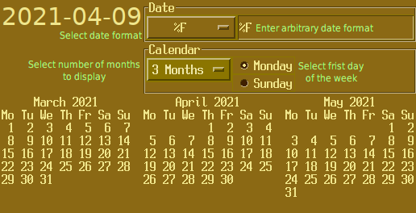

.. GradeProject2021 documentation master file, created by
   sphinx-quickstart on Fri Apr  9 16:49:19 2021.
   You can adapt this file completely to your liking, but it should at least
   contain the root `toctree` directive.

Welcome to DateTime App's documentation!
============================================

.. toctree::
   :maxdepth: 2
   :caption: Contents:

   API

.. literalinclude:: ../restcalend.py
  :language: python
  :encoding: latin-1
  :linenos:

.. toctree::
   :maxdepth: 2
   :caption: Contents:

   calendar

This simple application allows you to test various :py:func:`time.strftime` style date formats and display one, three or twelve month calendar.

See 

Indices and tables
==================

* :ref:`genindex`
* :ref:`modindex`
* :ref:`search`
